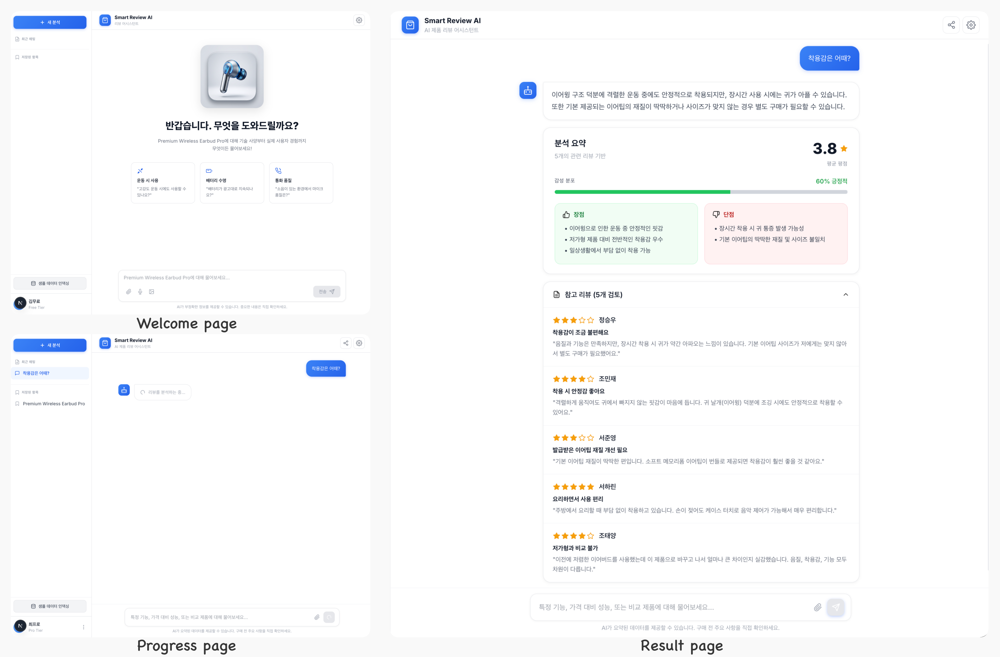

# Smart Review AI

> **AI 기반의 스마트한 쇼핑 리뷰 분석 어시스턴트**
>
> 실제 구매자들의 모든 리뷰를 실시간으로 분석하여, 사용자의 질문에 관련도가 높은 리뷰들을 선정하고 종합하여 정확한 답변을 제공합니다.

---

## 📸 Screenshots



---

## 🌟 Project Overview

**Smart Review AI**는 대량의 제품 리뷰 데이터를 의미론적으로 검색(Semantic Search)하고, 이를 거대언어모델(LLM)을 통해 종합분석하여 사용자에게 맞춤형 정보를 제공하는 풀스택 웹 애플리케이션입니다.

단순히 별점 평균을 보여주는 것을 넘어, 사용자가 궁금해하는 특정 포인트(예: "운동할 때 착용감이 어때?")에 대해 실제 리뷰 본문에서 구체적인 장단점을 추출하여 신뢰도 높은 가이드를 제시합니다.

---

## ✨ Key Features

### 🔍 지능형 분석 및 요약
- **Semantic Search:** 질문의 의도를 파악하여 관련도가 높은 리뷰를 최대 5개까지 정밀 검색합니다. (Pinecone Vector DB 활용)
- **AI Summary:** 검색된 리뷰들을 종합하여 평점 분포, 감성 분석, 그리고 구체적인 장단점(Pros/Cons)을 실시간으로 생성합니다.
- **Source Verification:** 답변의 근거가 된 실제 리뷰 원문을 즉시 확인할 수 있는 출처 표시 시스템을 갖추고 있습니다.

### 🎨 프리미엄 사용자 경험(UX)
- **Modern UI:** Glassmorphism 디자인과 3D 아이콘을 활용한 세련된 인터페이스를 제공합니다.
- **Dynamic Sidebar:** 최근 분석 기록과 관심 제품을 실시간으로 관리할 수 있는 지능형 사이드바가 포함되어 있습니다.
- **Adaptive Layout:** 모든 기기에서 최적의 가독성을 제공하기 위해 720px 너비 최적화 레이아웃을 적용했습니다.

### ⚡ 기술적 정교함
- **Vector Indexing:** CSV 데이터를 임베딩하여 벡터 데이터베이스에 인덱싱하는 파이프라인을 구축했습니다.
- **Local & Remote LLM:** LM Studio를 통한 로컬 모델 연동 및 OpenAI API를 유연하게 지원합니다.

---

## 🛠 Tech Stack

| Category | Technology |
| :--- | :--- |
| **Frontend** | Next.js 15 (App Router), React, TypeScript, Vanilla CSS |
| **AI/ML** | LangChain, OpenAI GPT, Vector Embeddings |
| **Database** | Pinecone (Vector Store), Supabase (Chat History) |
| **Icons & Design** | Lucide React, Custom 3D Assets (AI Generated) |
| **Local Dev** | LM Studio (Qwen-3.5 35B) |

---

## 🏗 System Architecture

1.  **Data Ingestion**: 제품 리뷰 데이터를 벡터화하여 **Pinecone**에 저장합니다.
2.  **Query Processing**: 사용자의 질문을 임베딩하여 **Cosine Similarity** 기반으로 관련 리뷰를 검색합니다.
3.  **RAG (Retrieval-Augmented Generation)**: 검색된 리뷰 컨텍스트를 LLM 프롬프트에 주입합니다.
4.  **Parsing & UI**: LLM의 응답을 답변, 장점, 단점으로 파싱하여 동적인 React 컴포넌트로 렌더링합니다.

---

## 🚀 Getting Started

```bash
# Dependencies 설치
npm install

# 환경 변수 설정 (.env.local)
NEXT_PUBLIC_SUPABASE_URL=...
NEXT_PUBLIC_SUPABASE_ANON_KEY=...
PINECONE_API_KEY=...
OPENAI_API_KEY=...

# 개발 서버 실행
npm run dev
```

---

*이 프로젝트는 사용자가 제품의 장단점을 파악하기 위해 수많은 리뷰를 직접 읽어야 하는 번거로움을 AI 기술로 해결하고자 시작되었습니다.*
